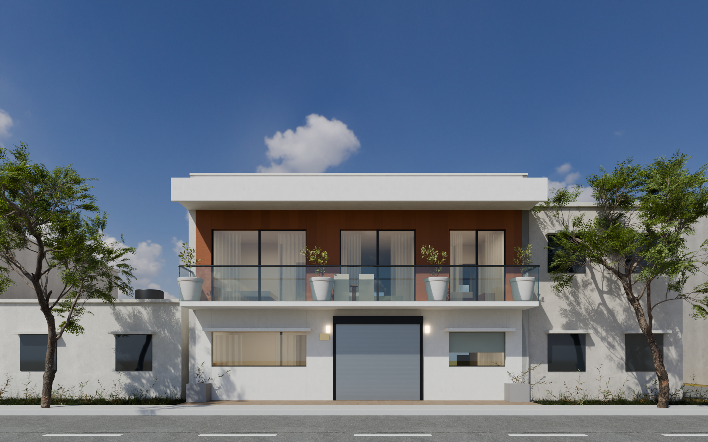

# Duplex · 4 bedrooms — design versions

Concept 3D models of our duplex, built from the hand-drawn plans in [`plans/`](plans). Each design version
is a tab in the viewer: walk through it in 3D, or flip to its photo-real renders.

**▶ Open the viewer: https://smohantty.github.io/myhome/** (`#v1` for a version, `#v1/renders` for its renders)



## Versions

| Tab | Idea |
|---|---|
| **V1 · Original sketch** (`#v1`) | As drawn: main door on the east side road into the double-height NE living, garage on the front, 4 bedrooms (2 down, 2 up + theatre/study) |
| **V2 · Front entrance** (`#v2`) | Main door on the front facing the road and mountains via a foyer; garage moved to the east side road with a terrace above; theatre/study removed so the first floor has 2 bedrooms and one large lounge |
| **V3 · Vastu showpiece** (`#v3`) | From [`plans/v3-ground-floor-sketch.jpg`](plans/v3-ground-floor-sketch.jpg), re-planned by Vastu: S4-pada main door in a recessed stone porch under a cantilevered teak view-box lounge facing the mountains; masters SW (jaali-screened), kitchen east with the cook facing east, NE open courtyard with tulsi + water, pooja NE, clockwise west stair, open centre; side-road wall fully closed |
| **V4 · Site plan v2 · 4BHK** (`#v4`) | The [`plans/house-plan-v4.png`](plans/house-plan-v4.png) plan built in 3D, inside the setback L of [`plans/site-plan-v2.png`](plans/site-plan-v2.png): S4 main door in a 4′ × 5′ portico recessed into the front with a balcony above (nothing built in the 15′ front open space), stair in the south, garage SE, 1 bedroom down (SW, attached bath) + common bath, master SW + bedrooms 3 and 4 up, kitchen/store/utility in the east wing, pooja in the NE corner of the terrace. No photo-real renders yet |
| **V5 · Wide portico** (`#v5`) | [`plans/house-plan-v5.png`](plans/house-plan-v5.png): V4 with a 10½′ × 5′ recessed portico and balcony; to fit it the stair moves 5′ north, over the centre of the main block (against Vastu). Living becomes 17′ × 13′ + lobby. No photo-real renders yet |
| **V6 · Open garage** (`#v6`) | [`plans/house-plan-v6.png`](plans/house-plan-v6.png): V4 without a portico: the garage is an open carport and the S4 main door sits flush on the front wall right beside it, with a side door from the carport into the foyer for a covered entry. Foyer back to 4′ × 11′, gallery upstairs with a front window. No photo-real renders yet |

## Layout

| Path | What it is |
|---|---|
| `index.html` | Viewer: a tab per version · 3D overview with floor cut-aways · first-person walk (WASD + mouse, stairs work) · room jump list · minimap · `.glb`/`.obj` export · renders gallery |
| `designs/manifest.js` | Which versions appear as tabs, in order |
| `designs/<id>/design.js` | The version's layout: rooms, walls, openings, stair, furniture |
| `designs/<id>/render.py` | The version's Blender extras (entrance, furniture models, curtains, lights) and cameras |
| `designs/<id>/renders/*.png` | Photo-real renders shown in the Renders tab |
| `designs/<id>/house_geometry.json` | Geometry exported from `design.js`, so renders match the walkthrough |
| `render/build_scene.py` | Shared Blender pipeline: materials, site, trees, sky, render settings |
| `render/fetch_assets.py` | Downloads the free CC0 [Poly Haven](https://polyhaven.com) sky, textures, plants and furniture (~300 MB, not committed) |
| `tools/export_geometry.mjs` | Exports `design.js` geometry for Blender (needs `npm i -g puppeteer` + Chrome) |
| `plans/` | Original site plan and floor plan sketches; `site-plan-v2.html` / `.png` is the Vastu setback site plan (construction area + every gap); `house-plan-v4/v5/v6.html` / `.png` are the 2D floor plans of viewer tabs V4–V6 on it |

The viewer also works opened straight from disk (double-click `index.html`).

## Add a new version

1. Copy a version: `cp -r designs/v1 designs/v2`, delete `designs/v2/renders/*.png`.
2. In `designs/v2/design.js` change `id: 'v2'` and `name`, then edit the layout (`rooms` drive floor colours,
   labels, minimap and the room list; `build()` places walls, stair and furniture).
3. Add `'v2'` to `designs/manifest.js` — it now has its own tab.
4. For renders: adjust `designs/v2/render.py` (cameras, extras), then
   ```sh
   node tools/export_geometry.mjs v2
   /Applications/Blender.app/Contents/MacOS/Blender -b -P render/build_scene.py -- --design v2 --cam front
   ```

## Render a version

```sh
python3 render/fetch_assets.py            # once: sky HDRI, scanned textures, trees, furniture
node tools/export_geometry.mjs v1         # after editing design.js
/Applications/Blender.app/Contents/MacOS/Blender -b -P render/build_scene.py -- \
  --design v1 --cam front                 # cameras: see CAMERAS in designs/v1/render.py
                                          # options: --samples 256 --res 1920x1200 --exposure 0 --out file.png
```
Output goes to `designs/<id>/renders/<cam>.png`; the Blender scene is saved as `designs/<id>/scene.blend` (not committed).

## V1 assumptions

- Floor-to-floor 10′, plinth 6″; drawings not exactly to scale, labelled room sizes used.
- Door positions inferred where the sketch was unclear (master suite via dress off the lobby; bedroom 4 via DR off the gallery).
- Terracotta cladding, balcony canopy, window sunshades, entrance canopy are design suggestions, not from the sketch.
- Neighbours are placeholder blocks. Concept only — have a local architect check structure and bye-laws.
